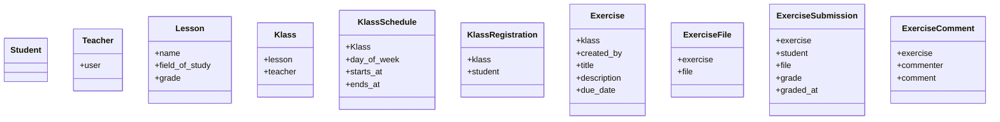

```mermaid
classDiagram
    class Student {

    }

    class Teacher {
        +user

    }

    class Lesson {
        +name
        +field_of_study
        +grade
    }

    class Klass{
        +lesson
        +teacher
    }


    class KlassSchedule {
        +Klass
        +day_of_week
        +starts_at
        +ends_at
    }

    class KlassRegistration {
        +klass
        +student
    }

    class Exercise {
        +klass
        +created_by
        +title
        +description
        +due_date
    }

    class ExerciseFile {
        +exercise
        +file
    }

    class ExerciseSubmission {
        +exercise
        +student
        +file
        +grade
        +graded_at
    }

    class ExerciseComment {
        +exercise
        +commenter
        +comment
    }
```
